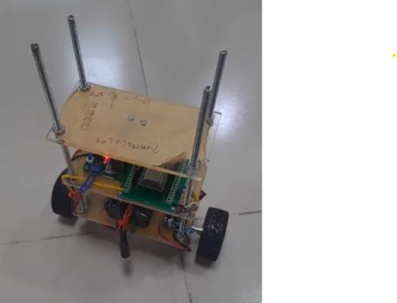
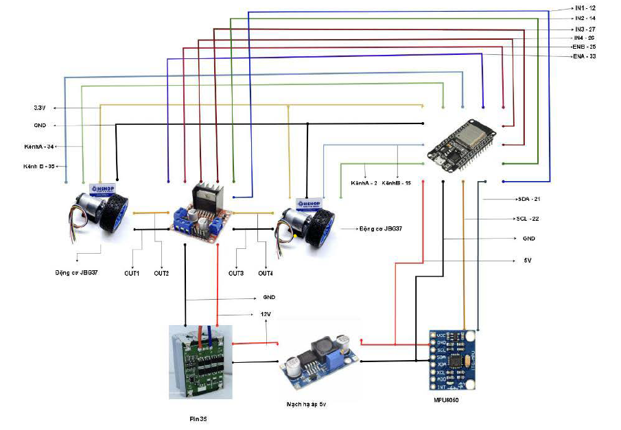

# TWO-WHEEL SELF-BALANCING ROBOT
## INTRODUCTION
A self-balancing two-wheeled vehicle is a compact system capable of maintaining stability through sensors and control algorithms. Because it only has two wheels, the system must continuously adjust its position to prevent falling. IMU data on tilt and motion is transmitted to a monitoring interface built using Node-RED and MQTT. In the current version, the system only monitors the motor speed and cannot directly control it yet. This monitoring provides useful insights into the vehicle’s operation and forms the basis for future control features.

## HARDWARES
- ESP32
- MPU6050
- L298N 
- Motor JGA37-520 333RPM x 2
- Battery 12v
- Ổn áp 12V XL6009 x 1
- Switch power



## Schematic


## Tuning PID
The PID parameters in this code are provided only as a reference and are specific to my hardware setup. You will need to retune the PID controller for your own system. The tuning order I recommend is P, D, and then I. First, increase the P gain until the system begins to overshoot. Next, adjust the D gain to help stabilize the response. Finally, fine-tune the I gain to reduce any remaining steady-state error over time.

## Clone my project:
```bash
git clone https://github.com/minhthong2514/SELF_BALACING_ROBOT.git
```

# Results
### GUI
https://github.com/user-attachments/assets/62aa860f-5bdb-4b3d-9ef6-057d7cb7f628
### Balancing Mode
https://github.com/user-attachments/assets/e0b75a1c-9a42-4c8f-a1b0-91bae187dc8c
